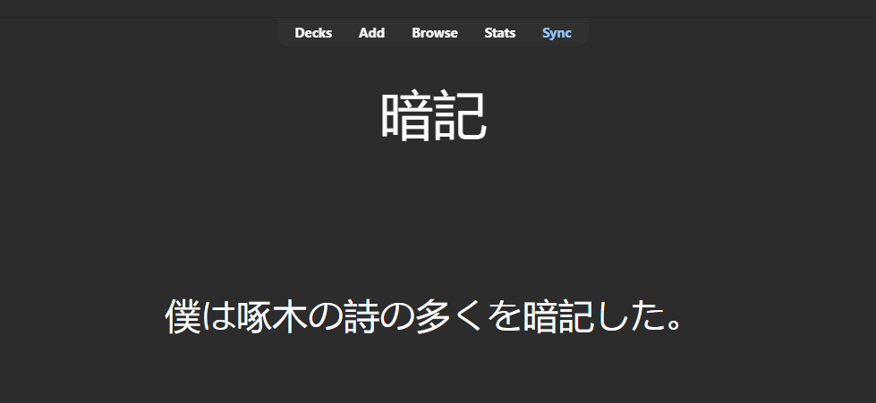
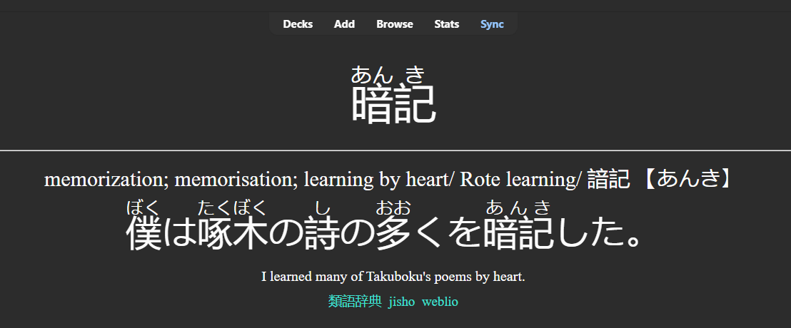

# Anki-Notes-Creator

## Objective:

Creates complete and well structured cards for japanese vocabulary in Anki. The Anki Notes Creator automatically generates cards from a text file containing just the desired target words. **Using just the desired word, the notes are created with the word and an example sentence on the front, and the translation of both on the back, along with the pronunciation of each ideogram and links to online dictionaries for the word.**

### Example:  

#### Front:


#### Back:


### Requirements:

To run this project, you need to have Anki installed, in any version, and Anki-Connect, with a version compatible with the installed Anki.

To install Anki:
https://apps.ankiweb.net/

To install Anki-Connect:
https://foosoft.net/projects/anki-connect/

### How to use:

With Anki open, double click on "card_model.apkg" to import the necessary card model into anki. The deck can be deleted after importing; it only serves to create a correct card template.  
Run ``` pip install -r /path/to/requirements.txt ``` to install the necessary libraries.  
Next, run the "main.py" file. It will create a test deck "test1" and add the words from the "add_words.txt" file as cards.
To add your words to your deck, simply change the "deck_name" variable to the name of your deck and add the words to the "add_words.txt" file.

### Notes:

The "add_words.txt" file should be formatted as follows:
```txt
word1
word2
word3
...
```